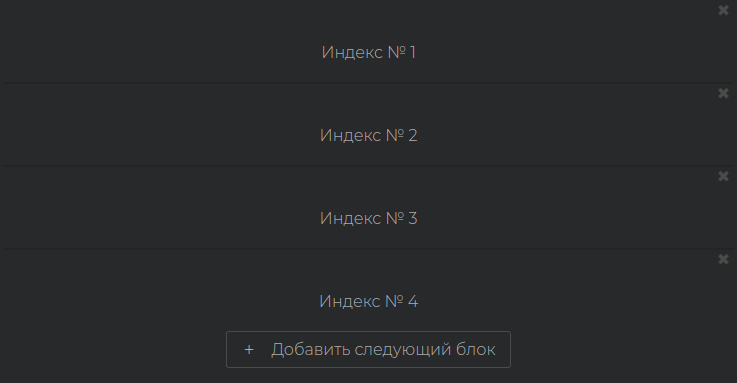

# MultiBox

> **"MultiBox"** предоставляет функциональность для динамического добавления и управления блоками с элементами формы.

### Динамическое добавление блоков с элементами формы

Компонент **"MultiBox"** позволяет создавать группы элементов формы в динамически добавляемых блоках. Это удобно, когда требуется обеспечить гибкость и расширяемость пользовательской формы.

### Конфигурация компонента "MultiBox"

Для создания динамически добавляемых блоков с элементами формы, используйте следующую конфигурацию:

```json
{
  "common": {
    "type": "MultiBox",
    "model": "MyModel"
  },
  "custom": {
    "title": "Индекс №",
    "addIndex": true
  }
}
```

- **"type"**: Тип компонента. Установите как **"MultiBox"**.
- **"model"**: Модель, связанная с компонентом. Каждый блок будет использовать эту модель для хранения данных.

### Опция **"addIndex"**

Параметр `"addIndex": true` позволяет добавлять индексы к каждому блоку, чтобы обозначить порядок. Первый блок будет иметь индекс 1, второй - 2 и так далее.

Пример:



В случае необходимости удаления ненужного блока вы можете прост оудалить его нажав крестик вправом верхнем углу созданного блока.

### Пример использования

Пример ниже демонстрирует конфигурацию компонента **"MultiBox"** с одним вложенным компонентом **"InputText"**:

```json
{
  "common": {
    "type": "MultiBox",
    "model": "MyModel"
  },
  "custom": {
    "title": "Мой тайтл для раздела",
    "addIndex": false
  },
  "text": {
    "addButton": "#Добавить новый блок"
  },
  "components": [
    {
      "common": {
        "type": "InputText",
        "model": "Мой тайтл для блока"
      },
      "custom": {
        "pattern": "/^.{0,40}$/i"
      },
      "validation": {
        "required": true,
        "texts": {
          "required": "#Обязательное поле"
        }
      },
      "text": {
        "label": "#Текст для инпута"
      }
    }
  ]
}
```

Использование компонента **"MultiBox"** позволяет создавать динамические блоки с элементами формы, обеспечивая удобство для пользователей в добавлении и удалении данных. Путем настройки каждого компонента внутри блоков вы можете создавать гибкие пользовательские формы с возможностью масштабирования и расширения.
