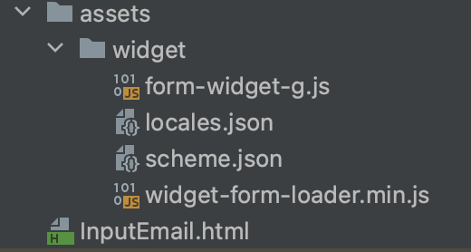

# Подключение формы в проект.

Подключение формы с использованием виджета <form-widget-g>! Этот виджет предоставляет удобное и быстрое решение для интеграции индивидуальной формы сбора данных на вашем веб-сайте. Следуйте инструкциям ниже, чтобы успешно добавить и настроить этот виджет на вашей странице.

### Шаг 1: Встраивание Виджета на Сайт

Чтобы добавить форму на ваш веб-сайт, используйте следующий код:

```html
<form-widget-g
    data-project-id="62508e2544f0831be0b66a0b"
    data-path="./assets/widget"
    data-page="input-email"
    data-language="en"
    data-theme="light"
    data-dump-model="true"
></form-widget-g>
```

Замените атрибут `data-project-id` значением идентификатора вашего проекта.

### Шаг 2: Подключение Ресурсов

Убедитесь, что ресурсы виджета, указанные в атрибуте `data-path`, доступны по заданному пути. Виджет может зависеть от стилей и скриптов, которые необходимо включить на вашей странице.



Будьте внимательны к пути разещения файлов, которые должны быть в одной папке (player будет создавать **widget** - название папки можете менять после сборки формы из репозитория `player`).
Обязательные файлы в одной папке:

```html
form-widget-g.js
locales.json
scheme.json
widget-form-loader.min.js
```

### Шаг 3: Настройка Параметров Виджета

- **data-page**: Задайте имя страницы, на которой размещена форма. Это может быть любая строка, которая поможет идентифицировать местоположение формы на вашем сайте. При использовании нескольких страниц формы, указанное название страницы `input-email` будет открываться первым при загрузке формы.
- **data-language**: Выберите язык, на котором будет отображаться текст формы. Укажите соответствующий код языка (например, `"en"` для английского).
- **data-theme**: Определите тему оформления формы, указав `"light"` (светлая) или `"dark"` (темная).
- **data-dump-model**: Если установлено значение `"true"`, форма будет предоставлять модель данных для дополнительной обработки.

### Шаг 4: Интеграция и Адаптация

После встраивания виджета и настройки параметров вы можете начать интеграцию с вашим сайтом. При необходимости вы можете адаптировать внешний вид, поведение и обработку данных формы согласно вашим требованиям.

Мы надеемся, что данная документация поможет вам успешно интегрировать и настроить форму на вашем веб-сайте с помощью виджета <form-widget-g>. Если у вас возникнут вопросы или потребуется дополнительная помощь, не стесняйтесь обращаться к нашей поддержке.